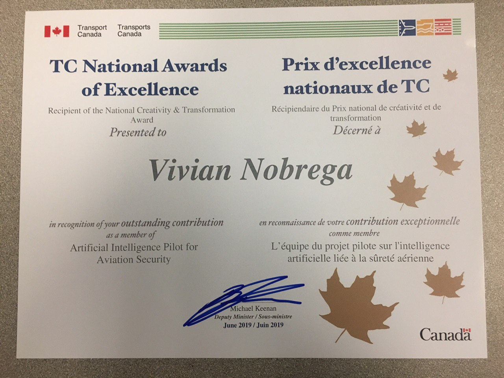

[Back](../)
 
# Honors
 

 
In June 2019, I received the above award for my work on a pilot project for Aviation Security. An amazing honour for the work I contributed as a Technical Advisor and for a period as a Project Manager, and a heap of other interesting duties related.
 
---
 
However, until this post, I never publicly disclosed, shared, or talked about how I felt about receiving this award and the struggle for career development.
 
It took me nearly half a year of reflection to be able to express why.
 
# Meritocracy
 
The [1920 designed Competitive Staffing System](https://www.canada.ca/en/public-service-commission/services/publications/publications/100-years-public-service-commission-canada-1908-2008.html#toc6.0) was originally introduced to produce a transparent, fair, and merit based selection of staffing processes. From my perspective, this process seems to be layered to protect the employer from staffing grievances instead of a process that focuses on attracting, retaining and managing talent. The goal of the new staffing direction released in 2016 was to give hiring managers more flexibility to overcome the challenges associated with the formality and layered staffing process.
 
The formality of the staffing process combined with an application form that demands a specific style of writing and specific form of speech in order to avoid being eliminated from the screening process. The unfortunate reality is that the only way to learn those styles and how to compete in this staffing process is experience - by having gone through and learned from this process numerous times. 
 
That experience can often be shared, from mentors and managers who can support you, but only assuming they are comfortable teaching you...
 
The rigor of the staffing process can be a massive barrier for individuals who do not meet societal norms. The availability of a mentor who has the time and willingness to assist is limited when you add racial, gender, sexuality or ideological differences.
 
Working in the Information Technology (IT) field, I find IT management is in an uncomfortable position. With a vast majority of the CS workforce that are 40 or older and a consistently growing demand for CS work, poaching from other departments or IT companies has become the fastest and easiest way to provide talent with opportunities. Instead of investing in staff, departments leverage the use of the outdated Competition System, giving other departments the “Risk” associated with awarding an individual a higher level.
 
This has culminated in the vast majority of advice from management I’ve had:
 
Stop doing the work you were hired to do, and spend the time applying to competitions until you manage to get it right.
 
# The Award
 
So why did I not talk about it?
 
Plain and simple: It didn’t make me feel good at all.
 
Before I was presented the award, I was told by my Senior Management that they would in no way support a promotion. That competitions were the only medium they would support, and if I really wanted to advance my career I could apply for positions elsewhere that they may or may not be able to counter offer.
 
Despite support from my Manager and Director and an award from the DM, my desire for career development and progression had absolutely no support from Senior Management level.
 
The lack of communication from Senior Management to the working level only gives way to a cycle of rumors and gossip of unverified statements that becomes a hushed conversation amongst the working level.
 
That question of why probably won’t ever be answered, but what was clear to me – without senior management belief and support, there was nothing more than I or any of my colleagues can do for the Department. The award had no substance – empty – as it is just a piece of paper, a breakfast and a handshake.
 
So yah, I won an award from the Deputy Minister -
 
I left the toxic environment the next month.
