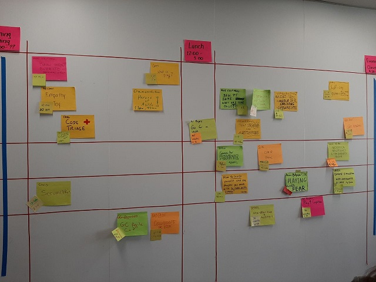

# Unconferences

For my first unconference, I had the pleasure of attending [Play4Agile](https://play4agilenorthamerica.com), an Open Space (Technology) 'unconference' focused on 'Growing Empathy with Play'. This is the first in a series of information sharing/debrief for my team I plan to do from the event.

## Chaos vs Anarchy

Chaos and Anarchy are interesting subjects in the face of the GC; Long have policies and mechanisms been put in place to ensure that neither Chaos nor Anarchy ever have the ability to influence decision making. Unfortunately this ideology has a stumbling block as the rate of change in technology rapidly keeps increasing. Rules and Policies that were put in place just six months ago can often be obstructers to brand new technology that could be a massive cost or time saving to the GC.

While Anarchy has no real inherent value, especially in Government where the impact of such could legitimately hurt people, Chaos can be a useful tool for the disruption of stale and outdated ideologies. It gives people a chance to work in new, interesting, and different ways and lets people experiment without feeling tied to current culture or social queues.

Agility is about maximizing Chaos, and minimizing Anarchy.

You can find many people who claim they run Agile processes, but in fact are just running forward in Anarchy - without structure, and discipline you're not practicing Agile.

## Meetings and Conferences

An 'Unconference', or 'Unmeeting' is an agile way of performing Conferences and Meeting. In general, an Unconference would contain several 'Unmeetings'.

The structure of an Unconference is formed and handled by the Facilitators, they ensure that the Conferences Code of Conduct, and the basic rules are upheld through the event.

While the level of structure can and will be different from one conference to another, the ideology around it remains the same.

### The Rules

The core of an 'Unconference' is the rules. 

#### 1. Whomever comes is the right person.

Essentially the this is that the size of a group or session does not mean it has no value. Even the most malicious compliance of this rule shows the value of it. An example shared of this was a pair of individuals who were forced to attend another Unconference style session - they sat in the corner and played chess. This kind of visible 'vote of confidence' would of never occured in a traditional meeting, allowing Management to clearly see issues related to Morale and Engagement and rethink the way they approached what they 'required' staff to do.

#### 2. Whatever Happens is the only thing that could have.

An Unconference packs more content then you normally can even process or consume, and it's important to focus on your personal needs, mental and physical health and not focus on what could have should have, or would have happened. It is an invigorating medium for any topics you are actually interested in - but is physically and mentally taxing in ways that sitting in chairs for hours being talked to does not.

#### 3. Whenever it starts is the right time.

Is a reminder that creativity, and inspiration are rarely items tied to a clock - new ideas could form at any time, and they happen when they happen.

#### 4. When it's over, it's over.

Is really just a principle saying that you shouldn't waste your time - if a subject or activity is complete, move on.

---

Supplementary to these are is The Law of Two Feet : If you feel you aren't contributing, adding value or gaining value - use your feet. Move on to other areas of the conference.

Finally, the Code of Conduct, which in general is what one would expect in any professional setting, that harassment, violence, discrimination, etc.. won't be tolerated.

### The Structure - An Open Market for Innovation

The Structure is the heart of the Unconference, this is functionally an Agenda built during the Unconference. Defined as the Marketplace it provides a list of spaces available, and ties them to a time. Individuals then present what they attend to speak about, or facilitate and then place the respective item on the Agenda in a location around the time they'd like.

After the initial drafting of the Agenda, those hosting sessions are then asked to update their items with start times. 

When the agenda is complete the Open Conference begins and individuals head off to the respective areas of their interest. If an activity, presentation or talk goes over it's time and the participants and hosts wish to continue they can move to another space or continue to use it if it had no planned sessions inside it.

It's important to value and respect the health of others - a good facilitator won't allow individuals to place items 5 minutes before lunch, or even during it - or right at the end of the conference.

### Attendees - Bees, Groundhogs and Butterflies

At Play4Agile, the types of attendees were categorized into a playful metaphor of bees, groundhogs and butterflies. Anyone can transform from one of these to the other.

#### Butterflies

Butterflies are the type of individual who sit and look relaxed. They sit in on sessions with interesting discussions and ideas form around them when they pause to chat.

#### Groundhogs

With the massive wealth of information, especially in longer conferences, ever so often it's best for individuals to take a break. Spending a bit of time to take a breather and focus on oneself is important.

#### Bees

Bees are the principle followers of the law of two feet, where they shift from session to session at their own whim cross-pollinating  discussion and allowing ideas to bloom.